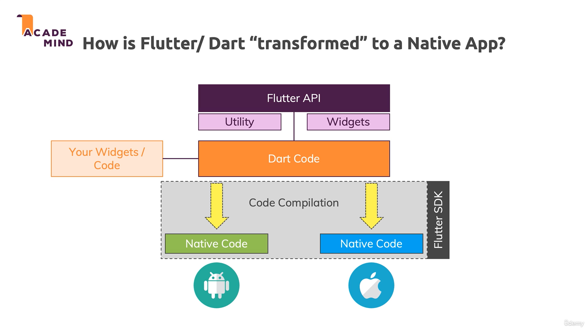

# Architecture

 

- SDK (software development kit): tools to compile your code to native machine code + develop with ease
- Framework/ Widget library: Re-usable UI building blocks (= widgets), utility functions, packages 